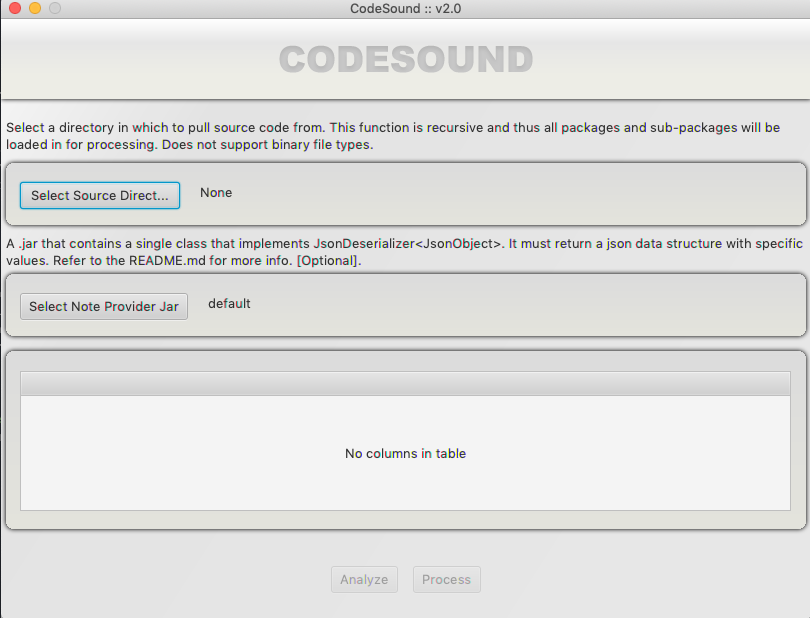

# code-sound-fx
listen to your code



## General Use *requires jvm 11*

1) download the distribution tar or zip from the releases section
of this page
2) run the sh or bat file
3) select a project source directory
4) select a note provider jar *optional*
5) analyze the directory tree
6) process the files
7) listen

## Caveats

- recursive processing of enormous directory structures would be nearly
 impossible to visualize. Therefore, the max number of files to be processed
 is set at 1024. If a directory exceeds this amount, an error is thrown. 
- saving of the generated midi is currently not available.

## Creating a custom note provider
- a jar containing a single class that implements `JsonDeserializer<JsonObject>`.
This is a `com.google.gson` class.
- this JSON data structure is as follows :
```json
{
    "line":"",
    "note":0,
    "duration":0,
    "octave":0,
    "velocity":0,
    "channel":0,
    "lineLength":0,
    "offset":0,
    "max":0,
    "min":0
}
``` 
- line: the raw line read from the input file
- note: any valid midi note, integer value
- duration: integer value of microseconds to play from offset
- octave: a 12 note, directional offset from middle c; valid values are 0-9
- velocity: 0-129
- channel: this can vary from system to system. 
generally an integer between 0-128
- lineLength: length of the raw line
- offset: integer value of microseconds to wait before playing the note
- max: max line length of the file
- min: min line length of the file
- view the code-sound-fx-note-parser module within this source repository
 for an example